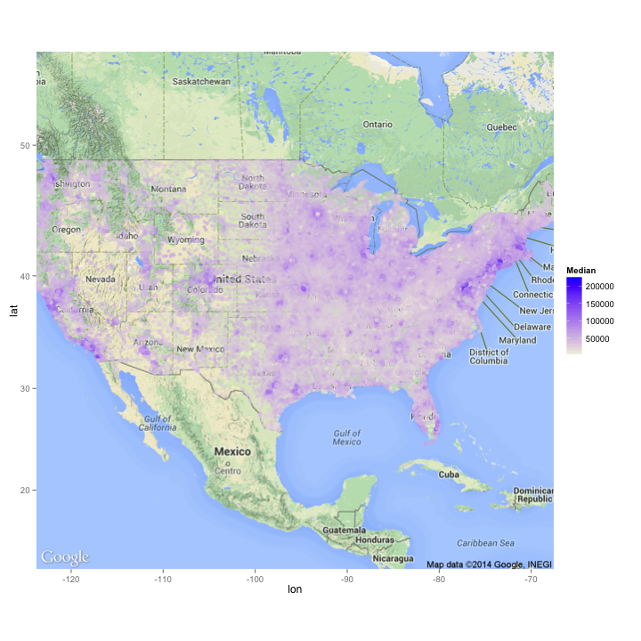

YouTube walkthrough:<a href="https://www.youtube.com/watch?v=EtJ-iTZeqTg&list=UUq4pm1i_VZqxKVVOz5qRBIA" target="_blank">Mapping The United States Census With { ggmap }: Machine Learning with R</a>
<BR><BR>

If you haven't played with the [ggmap](http://cran.r-project.org/web/packages/ggmap/index.html) package then you're in for a treat! It will map your data on any location around the world as long as you give it proper geographical coordinates.

Even though **ggmap** supports different map providers, I have only used it with Google Maps and that is what I will demonstrate in this article. We're going to download the median household income for the United States from the 2006 to 2010 census. Normally you would need to download a shape file from the [Census.gov](https://www.census.gov/geo/maps-data/data/tiger-line.html) site but the **University of Michigan's Institute for Social Research** graciously provides an Excel file for the national numbers. The file is limited to the mean and median household numbers for every zip code in the United States.
 
We're going to load two packages in order to download the data: [RCurl](http://cran.r-project.org/web/packages/RCurl/index.html) to handle HTTP protocols to download the file directly from the Internet and [xlsx](http://cran.r-project.org/web/packages/xlsx/index.html) to read the Excel file and load the sheet named 'Median' into our data.frame:

```r
# NOTE: if you can't download the file automatically, download it manually at:
# 'http://www.psc.isr.umich.edu/dis/census/Features/tract2zip/'
urlfile <-'http://www.psc.isr.umich.edu/dis/census/Features/tract2zip/MedianZIP-3.xlsx'
destfile <- "census20062010.xlsx"
download.file(urlfile, destfile, mode="wb")
census <- read.xlsx2(destfile, sheetName = "Median")
```
<BR>
We clean the file by keeping only the zip code and median household income variables and casting the median figures from factor to numbers:

```r
census <- census[c('Zip','Median..')]
names(census) <- c('Zip','Median')
census$Median <- as.character(census$Median)
census$Median <- as.numeric(gsub(',','',census$Median))
print(head(census,5))
```

```
##    Zip Median
## 1 1001  56663
## 2 1002  49853
## 3 1003  28462
## 4 1005  75423
## 5 1007  79076
```
<BR>
You will notice that the zip codes above only have 4 digits. We leverage another package called [zipcode](http://cran.r-project.org/web/packages/zipcode/index.html) to not only clean our zip codes by removing any '+4' data and padding with zeros where needed, but more importantly, to give us the central latitude and longitude coordinate for our zip codes (this requires downloading the zipcode data file):

```r
data(zipcode)
census$Zip <- clean.zipcodes(census$Zip)
```
<BR>
We merge our census data with the zipcode data on zip codes:

```r
census <- merge(census, zipcode, by.x='Zip', by.y='zip')
```
<BR>
Finally, we reach the heart of our mapping goal, we download a map of the United States using **ggmap**. For a more detailed introduction to ggmap, check out this [article](http://stat405.had.co.nz/ggmap.pdf) written by the authors of the package. The **get_map** function downloads the map as an image. Amongst the available parameters, we opt for zoom level 4 (which works well to cover the US), and request a colored, terrain-type map (versus satellite or black and white, amongst many otherr options):


```r
map<-get_map(location='united states', zoom=4, maptype = "terrain",
             source='google',color='color')
```

```
## Map from URL : http://maps.googleapis.com/maps/api/staticmap?center=united+states&zoom=4&size=%20640x640&scale=%202&maptype=terrain&sensor=false
## Google Maps API Terms of Service : http://developers.google.com/maps/terms
## Information from URL : http://maps.googleapis.com/maps/api/geocode/json?address=united+states&sensor=false
## Google Maps API Terms of Service : http://developers.google.com/maps/terms
```
<BR>
And [ggplot2](http://cran.r-project.org/web/packages/ggplot2/index.html) that will handle the graphics (based on the grammar of graphics) where we pass our census data with the geographical coordinates:


```r
ggmap(map) + geom_point(
        aes(x=longitude, y=latitude, show_guide = TRUE, colour=Median), 
        data=census, alpha=.5, na.rm = T)  + 
        scale_color_gradient(low="beige", high="blue")
```

 
<BR>
And there you have it, the median household income from 2006 to 2010 mapped onto a Google Map of the US in just a few lines of code! You can play around with the alpha setting to increase or decrease the transparency of the census data on the map.        
<BR><BR>        
[Full source](https://github.com/amunategui/Mapping-The-US-With-GGMAP/blob/master/ggmap-example.R):

```r
require(RCurl)
require(xlsx)

# NOTE if you can't download the file automatically, download it manually at:
# 'http://www.psc.isr.umich.edu/dis/census/Features/tract2zip/'
urlfile <-'http://www.psc.isr.umich.edu/dis/census/Features/tract2zip/MedianZIP-3.xlsx'
destfile <- "census20062010.xlsx"
download.file(urlfile, destfile, mode="wb")
census <- read.xlsx2(destfile, sheetName = "Median")

# clean up data
census <- census[c('Zip','Median..')]
names(census) <- c('Zip','Median')
census$Median <- as.character(census$Median)
census$Median <- as.numeric(gsub(',','',census$Median))
print(head(census,5))

# get geographical coordinates from zipcode
require(zipcode)
data(zipcode)
census$Zip <- clean.zipcodes(census$Zip)
census <- merge(census, zipcode, by.x='Zip', by.y='zip')

# get a Google map
require(ggmap)
map<-get_map(location='united states', zoom=4, maptype = "terrain",
             source='google',color='color')

# plot it with ggplot2
require("ggplot2")
require("RColorBrewer")
ggmap(map) + geom_point(
        aes(x=longitude, y=latitude, show_guide = TRUE, colour=Median), 
        data=census, alpha=.8, na.rm = T)  + 
        scale_color_gradient(low="beige", high="blue")
```

<div class="row">   
    <div class="span9 column">
            <p class="pull-right"> <a href="{{page.previous.url}}" title="Previous Post: {{page.previous.title}}"><i class="icon-chevron-left"></i></a>          <a href="{{page.next.url}}" title="Next Post: {{page.next.title}}"><i class="icon-chevron-right"></i></a>    </p>  
    </div>
</div>

<div class="row">   
    <div class="span9 columns">    
        <h2>Comments Section</h2>
        <p>Feel free to comment on the post but keep it clean and on topic.</p> 
        <div id="disqus_thread"></div>
        <script type="text/javascript">
            /* * * CONFIGURATION VARIABLES: EDIT BEFORE PASTING INTO YOUR WEBPAGE * * */
            var disqus_shortname = 'amunategui'; // required: replace example with your forum shortname
            var disqus_identifier = '{{ page.url }}';
            var disqus_url = 'http://amunategui.github.com{{ page.url }}';
            
            /* * * DON'T EDIT BELOW THIS LINE * * */
            (function() {
                var dsq = document.createElement('script'); dsq.type = 'text/javascript'; dsq.async = true;
                dsq.src = 'http://' + disqus_shortname + '.disqus.com/embed.js';
                (document.getElementsByTagName('head')[0] || document.getElementsByTagName('body')[0]).appendChild(dsq);
            })();
        </script>
        <noscript>Please enable JavaScript to view the <a href="http://disqus.com/?ref_noscript">comments powered by Disqus.</a></noscript>
        <a href="http://disqus.com" class="dsq-brlink">blog comments powered by <span class="logo-disqus">Disqus</span></a>
    </div>
</div>

