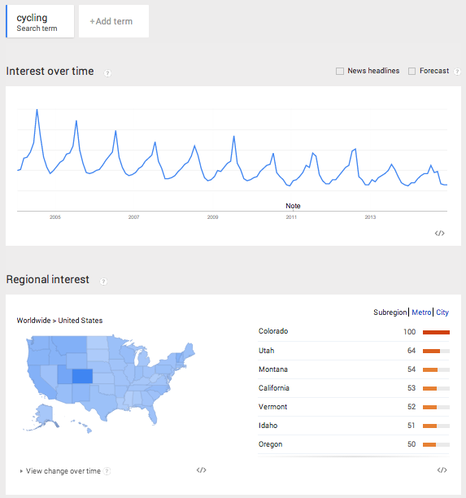
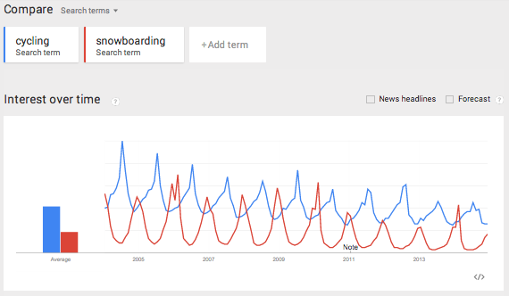
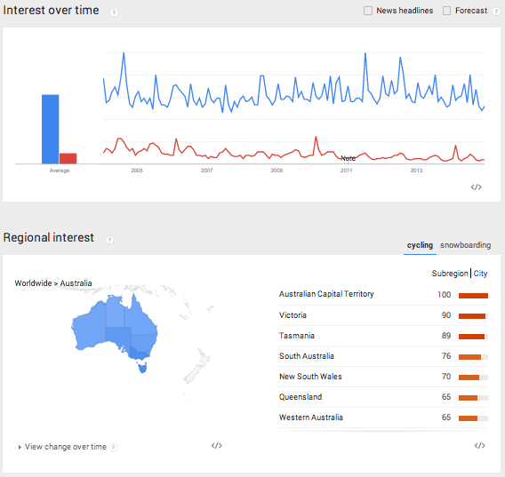
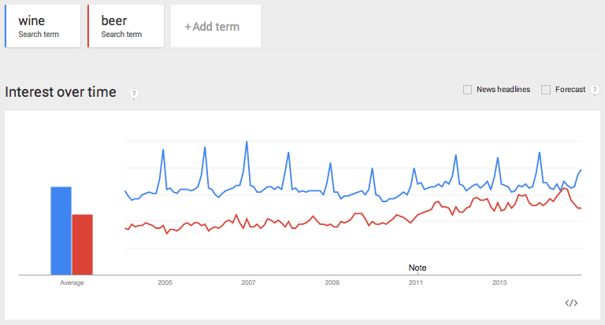
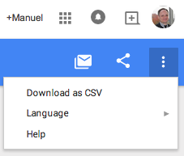
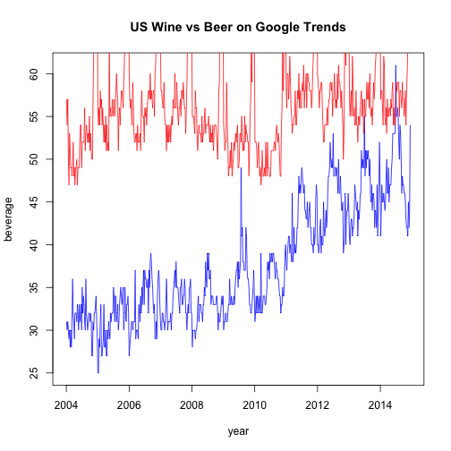
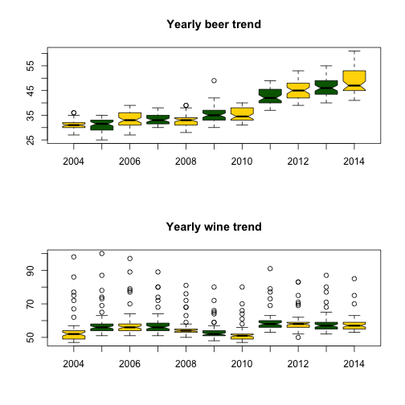
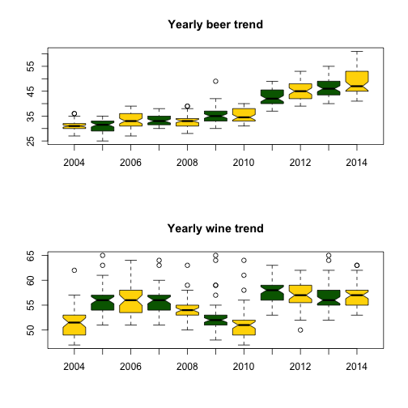
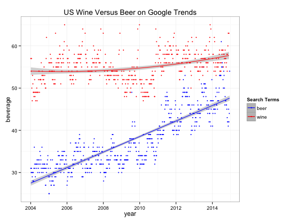

**Resources**
<ul>
<li type="square"><a href="https://www.youtube.com/user/mamunate/videos" target='_blank'>YouTube Companion Video</a></li>
<li type="square"><a href="#sourcecode">Full Source Code</a></li>
</ul>
<BR>
**Packages Used in this Walkthrough**

<ul>
        <li type="square"><b>{ggplot2}</b> - graphics</li>
</ul>

<BR><BR>
<b>Google Trends</b> has been around, in one form or another, for many years. Yet, it wasn't until I needed free Internet sentiment data that I took a closer look at this service and have been loving it ever since. With this tool you can easily target a time or region and find out what is trending up, down, or not at all - imagine all the possibilities!

<blockquote>Google Trends is a public web facility of Google Inc., based on Google Search, that shows how often a particular search-term is entered relative to the total search-volume across various regions of the world, and in various languages. (Source: <a href='http://en.wikipedia.org/wiki/Google_Trends' target='_blank'>Wikipedia.com</a>)</blockquote>

In this walkthrough, I introduce the tool by accessing it directly through a web browser to extract data and analyze it in R.
<BR><BR>
**Google Trends**

Let’s start by entering the term ``cycling`` and limiting our scope to the United States. There seems to be a decline in usage of that term between 2005 to 2014 as the oscillations are constant but the overall trend is dropping. 
<BR><BR>
 
<BR><BR>

The highest peak is July 2014 and represents the 100% maximum search for the term. Everything else is scaled from that peak, and that is how Google Trends displays a single search term over time (i.e. nothing will be over 100 in the graph). The term also peaks with clockwork regularity every summer. This decline can mean that people's interest in cycling is declining, that the term cycling in the English language is replaced by another more popular term, or that cyclists aren’t using Google like they used to (your theory is as good as mine). 

Let’s make things more interesting and add a second search term to our graph. Let’s add the term ``snowboarding``.

<BR>
 
<BR><BR>

This creates a mirror image of ``cycling``, where the peaks of one term are the troughs of the other. ``Snowboarding`` peaks every December, and, unlike cycling, the term hasn't dropped over the years.

So far, we’ve seen two interesting pieces of data using Google Trends: the term's popularity and its seasonal effect. There is plenty more to explore and compare as trends can be narrowed by time, region and city. Here we see both terms applied to ``Australia``. Clearly, ``cycling`` is more popular than ``snowboarding``...

<BR>
 
<BR><BR>
**Let's Code!**

OK, let's pull some data and analyze it in <b>R</b>. Query ``wine`` as the first term and ``beer`` as the second one and limit it to the US:

<BR>
 
<BR><BR>

Download the <b>csv</b> file from the dropdown located in the upper right corner:
<BR>
 
<BR><BR>
Now, let's access the file through <b>R</b>:

```r
filename <- "beervswine.csv"
```
<BR><BR>
If you open the csv file you will notice all sorts of information there. In order to just pull the main time series we need to loop through each line and start pulling the data at the 5th line and stop pulling as soon as we encounter empty fields. 


```r
con  <- file(filename, open = "r")
linecount <- 0
stringdata <- ""
while (length(oneLine <- readLines(con, n = 1, warn = FALSE)) > 0) {
        linecount <- linecount + 1
        
        if (linecount < 3) {
                filename <- paste0(filename,oneLine)     
        }
        
        # get headers at line 5
        if (linecount == 5) rowheaders = strsplit(oneLine, ",")[[1]]
        
        # skip firt 5 lines
        if (linecount > 5) {
                # break when there is no more main data
                if (gsub(pattern=",", x=oneLine, replacement="") == "") break
                
                stringdata <- paste0(stringdata,oneLine,"\n")
        }
}
close(con)
```
<br>
There are a few caveats worth talking about when working with <b>Google Trends</b> data. It can come in three time flavors: monthly, weekly, and daily. To get daily data, you need to query less than 3 months timespan. For longer term trends, you will usually get weekly data unless it is low popularity, and then you will get montly data. One more point, if you query multiple terms and some are don't return enough data, the csv will automatically exclude them.

```
> head(newData)
                       V1 V2 V3
1 2004-01-04 - 2004-01-10 31 57
2 2004-01-11 - 2004-01-17 30 54
3 2004-01-18 - 2004-01-24 31 57
4 2004-01-25 - 2004-01-31 30 50
5 2004-02-01 - 2004-02-07 29 47
6 2004-02-08 - 2004-02-14 30 53
```
<br>
In order to avoid the uncertainties of the final exported format, it is best to not hard code anything. To circumvent all this, we read the data line by line and store it all in one long string ``stringdata`` and add a line feed at the end of each line. We then use the ``read.table`` with ``textConnection`` to parse the ``stringdata`` into a flat file and append the dynamic column names pulled from line 5 of the csv. This allows us to get the correct header names whether Google returns ``1`` or ``10`` features/columns - this should limit surprises especially when working with multiple downloads.
<br>

```
newData <- read.table(textConnection(stringdata), sep=",", header=FALSE, stringsAsFactors = FALSE)
names(newData) <- rowheaders

newData$StartDate <- as.Date(sapply(strsplit(as.character(newData[,1]), " - "), `[`, 1))
newData$EndDate <- as.Date(sapply(strsplit(as.character(newData[,1]), " - "), `[`, 2))
newData$year <- sapply(strsplit(as.character(newData$StartDate), "-"), `[`, 1)
newData<- newData[c("StartDate", "EndDate", "beer", "wine", "year")]
```
<br><br>
Google Trends returns date ranges for each observations (rows), so we need to separate those into a ``StartDate`` and ``EndDate`` column. I also create a ``year`` column from the start date for use in <a href='http://stat.ethz.ch/R-manual/R-patched/library/graphics/html/boxplot.html' target='_blank'>boxplots</a>.

```
> head(newData)
   StartDate    EndDate beer wine year wine_clean
1 2004-01-04 2004-01-10   31   57 2004         57
2 2004-01-11 2004-01-17   30   54 2004         54
3 2004-01-18 2004-01-24   31   57 2004         57
4 2004-01-25 2004-01-31   30   50 2004         50
5 2004-02-01 2004-02-07   29   47 2004         47
6 2004-02-08 2004-02-14   30   53 2004         53
```
<Br><BR>
**Plots**

Here we confirm that the data is correct and should be similar to what we saw earlier on <b>Google Trends</b>.

```r
plot(newData$StartDate, newData$beer, type='l', col='Blue', main="US Wine vs Beer on Google Trends", xlab="year", ylab="beverage")
lines(newData$StartDate, newData$wine, type='l', col='Red')
```
<BR>
 
<BR><BR>
At first glance, ``beer`` seems to be trending upwards. Let's plot it by year in a ``boxplot`` to better view the differences:


```r
par(mfrow = c(2, 1))
# show box plots to account for seasonal outliers and stagnant trend
boxplot(beer~year, data=newData, notch=TRUE,
        col=(c("gold","darkgreen")),
        main="Yearly beer trend")

boxplot(wine~year, data=newData, notch=TRUE,
        col=(c("gold","darkgreen")),
        main="Yearly wine trend")
```

<BR>
 
<BR><BR>
<b>Outliers</b> seem to be plaguing ``wine`` - this may account for the December spikes. Let's remove them and try plotting again:

```r
# shamelessly borrowed from aL3xa -
# http://stackoverflow.com/questions/4787332/how-to-remove-outliers-from-a-dataset
remove_outliers <- function(x, na.rm = TRUE, ...) {
        qnt <- quantile(x, probs=c(.25, .75), na.rm = na.rm, ...)
        H <- 1.5 * IQR(x, na.rm = na.rm)
        y <- x
        y[x < (qnt[1] - H)] <- NA
        y[x > (qnt[2] + H)] <- NA
        y
}

par(mfrow = c(2, 1))
# show box plots to account for seasonal outliers and stagnant trend
boxplot(beer~year, data=newData, notch=TRUE,
        col=(c("gold","darkgreen")),
        main="Yearly beer trend")

newData$wine_clean <- remove_outliers(newData$wine)
boxplot(wine_clean~year, data=newData, notch=TRUE,
        col=(c("gold","darkgreen")),
        main="Yearly wine trend")
```

<BR>
 
<BR><BR>
Clearly, the term ``beer`` is trending upwards while ``wine`` is more erratic and range bound. <a href='http://cran.r-project.org/web/packages/ggplot2/index.html' target='_blank'>{ggplot2}</a> has great plotting functions to smooth out noise and amplify trends for better understanding:


```r
library(ggplot2)
ggplot(newData,aes(x=StartDate)) +
        stat_smooth(aes(y = beer, group=1, colour="beer"), method=lm, formula = y ~ poly(x,1), level=0.95) +
        stat_smooth(aes(y = wine_clean, group=1, colour="wine"), method=lm, formula = y ~ poly(x,2), level=0.95) +
        geom_point (aes(y = beer, colour = "beer"), size=1) +
        geom_point (aes(y = wine_clean, colour ="wine"), size=1) +
        scale_colour_manual("Search Terms", breaks = c("beer", "wine"), values = c("blue","red")) +
        theme_bw() +
        xlab("year") +
        ylab("beverage") +
        ggtitle("US Wine Versus Beer on Google Trends")
```

<BR>
 
<BR><BR>      
   
**Conclusion**

There isn't an easy way of concluding this - possibilities are endless. Analyze away! For more information on this tool, read this <a href='http://static.googleusercontent.com/media/www.google.com/en/us/googleblogs/pdfs/google_predicting_the_present.pdf' target='_blank'>great article by Hyunyoung Choi and Hal Varian</a>.

 <BR><BR>
<a id="sourcecode">Full source code (<a href='https://github.com/amunategui/' target='_blank'>also on GitHub</a>)</a>:

```r

setwd('//yourpath')

filename <- "beervswine.csv"
con  <- file(filename, open = "r")

linecount <- 0
stringdata <- ""
while (length(oneLine <- readLines(con, n = 1, warn = FALSE)) > 0) {
        linecount <- linecount + 1
        
        if (linecount < 3) {
                filename <- paste0(filename,oneLine)     
        }
        
        # get headers at line 5
        if (linecount == 5) rowheaders = strsplit(oneLine, ",")[[1]]
        
        # skip firt 5 lines
        if (linecount > 5) {
                # break when there is no more main data
                if (gsub(pattern=",", x=oneLine, replacement="") == "") break
                
                stringdata <- paste0(stringdata,oneLine,"\n")
        }
}
close(con)

newData <- read.table(textConnection(stringdata), sep=",", header=FALSE, stringsAsFactors = FALSE)
names(newData) <- rowheaders

head(newData)

newData$StartDate <- as.Date(sapply(strsplit(as.character(newData[,1]), " - "), `[`, 1))
newData$EndDate <- as.Date(sapply(strsplit(as.character(newData[,1]), " - "), `[`, 2))
newData$year <- sapply(strsplit(as.character(newData$StartDate), "-"), `[`, 1)
newData<- newData[c("StartDate", "EndDate", "beer", "wine", "year")]

head(newData)

plot(newData$year, newData$beer, type='l', col='Blue')
lines(newData$StartDate, newData$wine, type='l', col='Red')

par(mfrow = c(2, 1))
# show box plots to account for seasonal outliers and stagnant trend
boxplot(beer~year, data=newData, notch=TRUE,
        col=(c("gold","darkgreen")),
        main="Yearly beer trend")

boxplot(wine~year, data=newData, notch=TRUE,
        col=(c("gold","darkgreen")),
        main="Yearly wine trend")

# shamelessly borrowed from aL3xa -
# http://stackoverflow.com/questions/4787332/how-to-remove-outliers-from-a-dataset
remove_outliers <- function(x, na.rm = TRUE, ...) {
        qnt <- quantile(x, probs=c(.25, .75), na.rm = na.rm, ...)
        H <- 1.5 * IQR(x, na.rm = na.rm)
        y <- x
        y[x < (qnt[1] - H)] <- NA
        y[x > (qnt[2] + H)] <- NA
        y
}

par(mfrow = c(2, 1))
# show box plots to account for seasonal outliers and stagnant trend
boxplot(beer~year, data=newData, notch=TRUE,
        col=(c("gold","darkgreen")),
        main="Yearly beer trend")

newData$wine_clean <- remove_outliers(newData$wine)
boxplot(wine_clean~year, data=newData, notch=TRUE,
        col=(c("gold","darkgreen")),
        main="Yearly wine trend")


# smooth both trends and plot them together
par(mfrow = c(1, 1))
plot(newData$StartDate, newData$beer, type='l', col='Blue')
lines(newData$StartDate, newData$wine_clean, type='l', col='Red')


library(ggplot2)
ggplot(newData,aes(x=StartDate)) +
        stat_smooth(aes(y = beer, group=1, colour="beer"), method=lm, formula = y ~ poly(x,1), level=0.95) +
        stat_smooth(aes(y = wine_clean, group=1, colour="wine"), method=lm, formula = y ~ poly(x,2), level=0.95) +
        geom_point (aes(y = beer, colour = "beer"), size=1) +
        geom_point (aes(y = wine_clean, colour ="wine"), size=1) +
        scale_colour_manual("Search Terms", breaks = c("beer", "wine"), values = c("blue","red")) +
        theme_bw() +
        xlab("year") +
        ylab("beverage") +
        ggtitle("US Wine Versus Beer on Google Trends")


```
