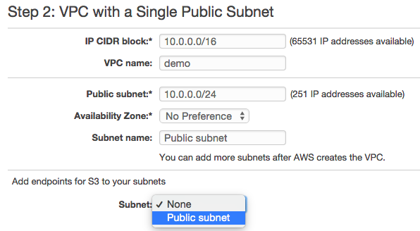
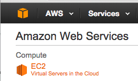

In this project, I will take a project idea, use <b>Python</b> to execute it, create an <b>AWS EC2</b> instance and use <b><a href='http://flask.pocoo.org' target='_blank'>Flask</a></b> to host it. Even though everything here is relatively simple, there is a lot of steps and you don’t want to miss any of them - take you time, have fun, when in doubt start again, and, most importantly, think about the possibilities!

<BR><BR>
<h2>Pagiarism Defender - A Python Application</h2>
<BR><BR>
OK, so I have a Python project that I want to push out on the web. Let's start by analyzing and running it locally.

```r
# sudo apt-get install python-lxml
from lxml import html
import requests, time
# sudo pip install -U nltk
from nltk.tokenize.punkt import PunktSentenceTokenizer, PunktParameters 

# Try it out on the first lines of Moby Dick:
text_to_check = "Call me Ishmael. Some years ago - never mind how long precisely - having little or no money in my purse, and nothing particular to interest me on shore, I thought I would sail about a little and see the watery part of the world."

punkt_param = PunktParameters()
sentence_splitter = PunktSentenceTokenizer(punkt_param)
sentences = sentence_splitter.tokenize(text_to_check)
probability_of_plagiarism = 0

for a_sentence in sentences:
    print(a_sentence)
    time.sleep(0.3)
    the_term = urllib2.quote('+' + '"' + a_sentence + '"')
    page = requests.get('https://www.bing.com/search?q='+the_term)
    if (not "No results found for" in page.text):
        probability_of_plagiarism += 1;

print('Probability of plagiarism: ' + str((probability_of_plagiarism / len(sentences)) * 100) + '%')

```
It correctly determined that the text passed to the function is indeed plagiarized:

```r
In [151]: print('Probability of plagiarism: ' + str((probability_of_plagiarism / len(sentences)) * 100) + '%')
Probability of plagiarism: 100%
```

This application is very simple, it takes as impout some text (``text_to_filter``), splits it into sentences using <a = href='http://www.nltk.org/' target='_blank'>Natural Language Toolkit (NLTK)</a>, and finally sends each to the Bing search engine for matches. It surrounds each sentence with quotes to find exact matches, if a match is found, then that sentence is deemed plagiarzied. It does so for all sentences and returns the mean as a plagiarizm score. 

This may not scale too well as Bing would quickly get upset, but for our purposes it is fine. Let's push this out onto the web and get some exposure.

<BR><BR>
<h2>Amazon Web Services - Home Away from Home</h2>
<BR><BR>
Now that we have our web application ready to go, we need the tools to serve it out to the world. We’ll start with our <a href='http://aws.amazon.com/' target='_blank'>Amazon Web Service EC2 instance</a>. You will need an AWS account to access the site. Even though this is all very simple, there are many of these simple steps; if you miss one, it will not work....

**AWS Console**<br>
First, log into the AWS console:
<BR>
 
<BR><BR>
**VPC**<br>
Select VPC:
<BR>

<BR><BR>
A virtual private connection (VPC) will determine who and what gets to access our site. We will use the wizard and content ourselves with only on VPC. In an enterprise-level application, you will want at least 4, 2 to be private and run your database, and two to be public and hold your web-serving application. By duplicating the private and public VPCs you can benefit from fail-over and load balancing tools. By keeping things simple, we’ll get our instance working in just a few clicks, seriously!

Start the wizard:
<BR>

<BR><BR>
Start the wizard and select ‘VPC with a Single Public Subnet':
<BR>

<BR><BR>
Most of the defaults are fine except add a name under ``VPC name`` and select ``Public subnet`` under ``Add endpoints for S3 to you subnets``:
<BR>

<BR><BR>


**EC2**<BR>
VPC is done, let’s create our EC2 instance - this is going to be our new machine. 

<BR>

<BR><BR>


 