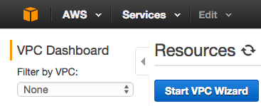
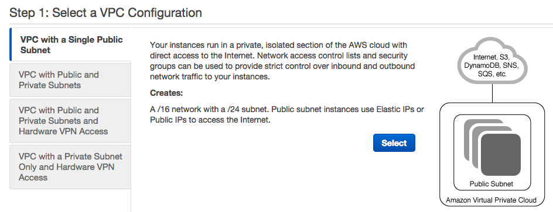
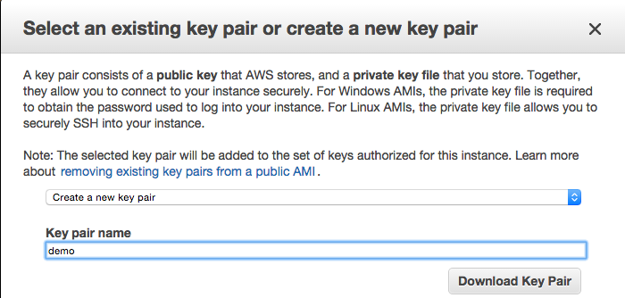
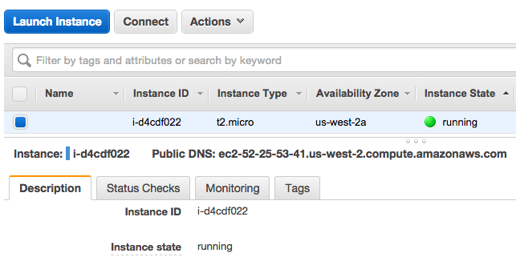
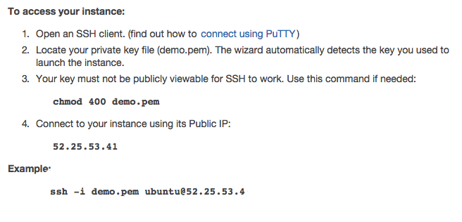
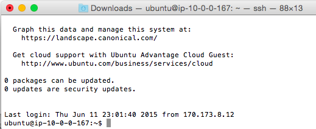

In this project, I take an idea coded in <b>Python</b>, create an <b>AWS EC2</b> instance, and use <b><a href='http://flask.pocoo.org' target='_blank'>Flask</a></b> to share it with the world. Even though everything here is relatively simple, there are a lot of steps and you don’t want to miss any - take you time, have fun, when in doubt start again, and, most importantly, think about the possibilities for your own work!

<BR>
<ul>
    <li type="square"><a href="#python-application">Plagiarism Defender - A Python Application</a></li>
    <li type="square"><a href="#amazon-web-services">Amazon Web Services (AWS)</a></li>
    <ul>
        <li type="square"><a href="#vpc">VPC</a></li>
        <li type="square"><a href="#ec2">EC2</a></li>
        <li type="square"><a href="#connecting-ec2">Connecting to EC2</a></li>
    </ul>
    <li type="square"><a href="#flask">Installing Flask</a></li>
    <li type="square"><a href="configuring-flask">Building the Flask Site</a></li>
</ul>

<BR><BR>
<h2><a id="python-application">Plagiarism Defender - A Python Application</a></h2>
<BR>
OK, so I have a Python project that I want to push out to the web. Let's first take a look at it. It should be straightforward; it takes some text as input (``text_to_filter``), splits it into sentences using <a = href='http://www.nltk.org/' target='_blank'>Natural Language Toolkit (NLTK)</a>, and sends it to the Bing search engine for matches. It surrounds each sentence with quotes to <b>only</b> find exact matches. If a match is found, then that sentence is deemed plagiarized and a counter is incremented. It does so for all sentences and returns the mean of the counter as a plagiarism score. 

```r
# sudo apt-get install python-lxml
from lxml import html
import requests, time
# sudo pip install -U nltk
from nltk.tokenize.punkt import PunktSentenceTokenizer, PunktParameters 

# Try it out on the first lines of Moby Dick:
text_to_check = "Call me Ishmael. Some years ago - never mind how long precisely - having little or no money in my purse, and nothing particular to interest me on shore, I thought I would sail about a little and see the watery part of the world."

punkt_param = PunktParameters()
sentence_splitter = PunktSentenceTokenizer(punkt_param)
sentences = sentence_splitter.tokenize(text_to_check)
probability_of_plagiarism = 0

for a_sentence in sentences:
    print(a_sentence)
    time.sleep(0.3)
    the_term = urllib2.quote('+' + '"' + a_sentence + '"')
    page = requests.get('https://www.bing.com/search?q='+the_term)
    if (not "No results found for" in page.text):
        probability_of_plagiarism += 1;

print('Probability of plagiarism: ' + str((probability_of_plagiarism / len(sentences)) * 100) + '%')

```
It correctly determined that the Moby Dick text passed to the function is plagiarized:

```r
In [151]: print('Probability of plagiarism: ' + str((probability_of_plagiarism / len(sentences)) * 100) + '%')
Probability of plagiarism: 100%
```

This may not scale too well as Bing would quickly get upset, but for our purposes it is fine. Let's push this out onto the web and get some exposure.

<BR><BR>
<h2><a id="amazon-web-services">Amazon Web Services - Home Away from Home</a></h2>
<BR>
Now that we have our web application ready to go, we need the tools to serve it out to the world. We’ll start with our <a href='http://aws.amazon.com/' target='_blank'>Amazon Web Service EC2 instance</a>. You will need an AWS account to access the site. Even though this is all very simple, there are many of these simple steps; if you miss one, it will not work....

**AWS Console**
<br>
First, log into the AWS console:
<BR><BR>
 
<BR><BR>
<h2><a id="vpc">VPC</a></h2>
Select VPC:
<BR><BR>

<BR><BR>
A virtual private connection (VPC) will determine who and what gets to access our site. We will use the wizard and content ourselves with only on VPC. In an enterprise-level application, you will want at least 4, 2 to be private and run your database, and two to be public and hold your web-serving application. By duplicating the private and public VPCs you can benefit from fail-over and load balancing tools. By keeping things simple, we’ll get our instance working in just a few clicks, seriously!

Start the wizard:
<BR><BR>

<BR><BR><BR>
Start the wizard and select ‘VPC with a Single Public Subnet':
<BR><BR>

<BR><BR><BR>
Most of the defaults are fine except add a name under ``VPC name`` and select ``Public subnet`` under ``Add endpoints for S3 to you subnets``:
<BR><BR>

<BR><BR><BR>


<h2><a id="vpc">EC2</a></h2>
<BR>
VPC is done, let’s now create our EC2 instance - this is going to be our new machine. Click on the orange cube in the upper left corner of the page. From the ensuing menu, choose the first option, ``EC2``

<BR><BR>

<BR><BR><BR>
Then ``Create Instance``...
<BR><BR>

<BR><BR><BR>
We’ll select the free eligible tier <a href='http://www.ubuntu.com/' target='_blank'>Ubuntu</a> box (may not always be free, check if it applies to you). 
<BR><BR>

<BR><BR><BR>
Go with defaults and click ``Next: Configure Instance Details``
<BR><BR>

<BR><BR><BR>
Under ``Step 3``, make sure to enable ‘Auto-assign IP’ and leave the rest as is.
<BR><BR>

<BR><BR><BR>
And in ``Step 7`` add a new rule to the security group. Click ``Add Rule`` and choose ``HTTP`` on port 80, this will allow for Internet traffic:
<BR><BR>

<BR><BR><BR>
It should look like the following:
<BR><BR>

<BR><BR><BR>
Once added, select ``Review and Launch``. We have one more step before reaching the instance - we need create a new ``key pair``. This is a security file that will live on your machine and is required to ‘SSH’ into the instance. I tend to create them and leave them in my downloads. What ever you decided to do, make sure you know where it is as you’ll need to pass a path to it every time you want to connect to it. 
<BR><BR>

<BR><BR><BR>
Name it whatever you like and hit the ``Download Key Pair``. Finally select ``Launch Instance`` and we’re ready to go! Keep in mind that whenever you instance is running, you may be charged by Amazon - read the documentation to make sure you’re OK with it. Also, stop the instance when you don’t need to slow down the charges, and terminate it when you don’t need it anymore (i.e. delete it) to stop all charges.

Once the instance is initialized and running, you should see a green light by it:
<BR><BR>

<BR><BR><BR>
Select the left check-box to access the settings of that specific instance.
<BR><BR>

<BR><BR><BR>

<h2><a id="connecting-ec2">Connecting to the EC2 Instance</a></h2>

Select the top ``Connect`` button to get the SSH connection string that enables connections. Follow the instructions if you want to use the Java terminal to connect to the instance. Here, I will be using the terminal on my Mac.
<BR><BR>

<BR><BR><BR>
The last line states your connection string: ``ssh -i demo.pem ubuntu@52.25.53.41``. To use it on the Mac, open your terminal and navigate to your ``Downloads`` folder (or wherever you moved your <b>pem</b> key-pair file).
<BR><BR>

<BR><BR><BR>
That is all you need to access the instance. If you are having issues with it, follow Amazon’s advice and set the correct permissions for you <b>pem</b> file by calling ``chmod 400 demo.pem``. Also, keep in mind, anytime you reboot your instance, your connection IP will be different.

Once you get in, you should see something along these lines:
<BR><BR>

<BR><BR><BR>
<BR><BR>
<h2><a id="installing-flask">Installing Flask on EC2</a></h2>
<BR><BR>
To keep things simple, we won’t use GIT or a virtual environment - fast and cheap, remember? But in the long run, you will benefit from using those tools.

Now, to get to Flask, we first need to install Apache:

Install Apache:
```r

sudo apt-get install apache2
sudo apt-2 update
sudo apt-get install libapache2-mod-wsgi

```

Install Flask:
```r

sudo apt-get install python-flask
sudo apt-get upgrade

```

We now have our web serving software installed. To verify that things are progressing properly, enter your I.P. address in the browser. This is what you should be seeing, the static Apache2 homepage:

<BR><BR>

<BR><BR><BR>
<BR><BR>
<h2><a id="configuring-flask">Configuring the Flask Site</a></h2>
<BR>

Now, lets create our file structure:

```r

cd /var/www
sudo mkdir FlaskApps
cd FlaskApps

```
and more:
```r

sudo mkdir FlaskApp
cd FlaskApp
sudo mkdir static
sudo mkdir templates

```

Let’s start with a simple page to confirm that Flask can serve dynamic pages. We’ll call up ‘nano’, a very simple text editor. 

```r

sudo nano home.py

```

and enter the following code:

```r

from flask import Flask
app=Flask(__name__)

@app.route('/')
def home():
    return  “This is from Flask!!"

if __name__ == "__main__":
    app.run()

```
